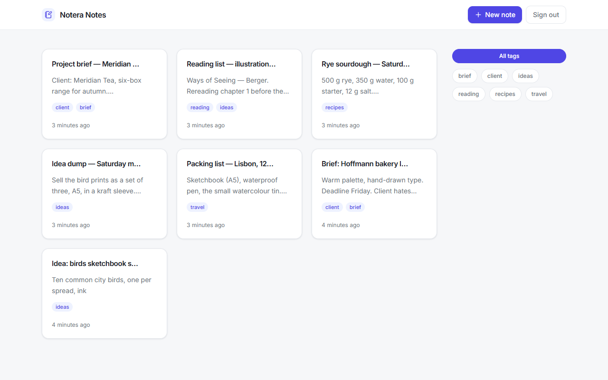
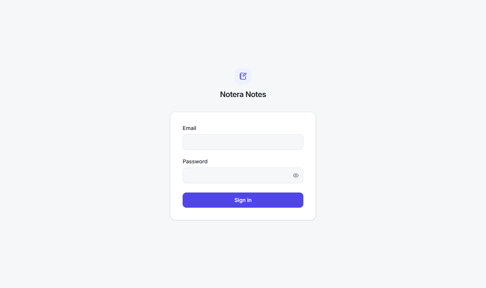
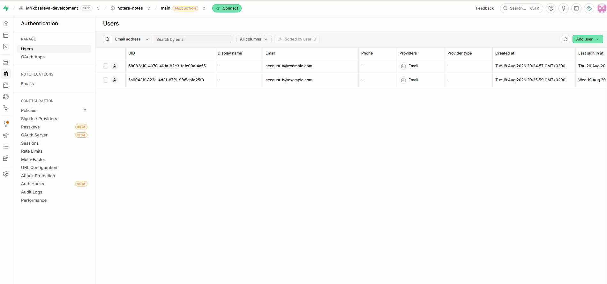
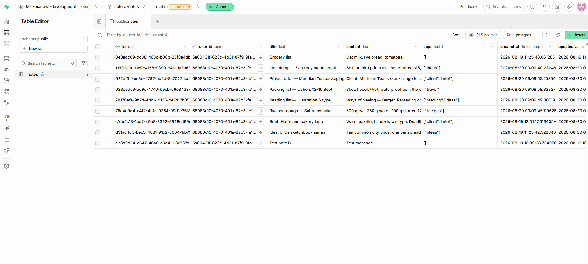
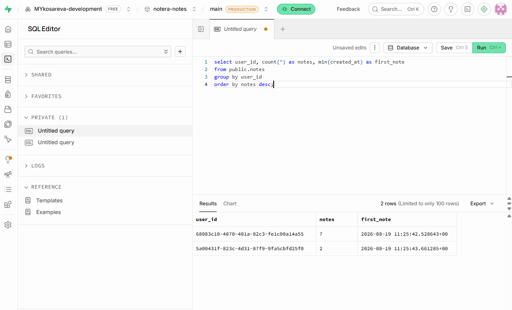

# Notera Notes

A private, per-user notes app. A signed-in user creates, edits, tags and deletes their
own notes; every account sees only its own rows, and the session is verified on the
server before a protected page renders. Unauthenticated visitors can reach nothing but
the sign-in page.



Runs locally only — this sprint has no build or deploy target.

## Stack

| Piece | Choice |
| --- | --- |
| Framework | Next.js 16 (**App Router only** — there is no `pages/` directory) |
| Language | TypeScript, `strict: true`, `noUnusedLocals: true`, no `any` |
| Styling | Tailwind CSS v4 |
| Backend | Supabase — Postgres for the notes, Supabase Auth for sign-in |
| Supabase clients | `@supabase/supabase-js` + `@supabase/ssr` (the session lives in cookies, never in web storage) |
| Icons / font | `lucide-react`, Inter via `next/font/google` |
| Runtime | Node ≥ 20.9 |

Reads happen in Server Components, writes in Server Actions — there are no custom API
routes. All notes access goes through one `server-only` module, `lib/notes.ts`, which
calls `supabase.auth.getUser()` itself and refuses to run without a user.

## Run it locally

1. **Install**

   ```bash
   npm install
   ```

2. **Create a Supabase project** at [supabase.com](https://supabase.com) (the free tier
   is enough).

3. **Create `.env.local`** from the template and fill in two values:

   ```bash
   cp .env.example .env.local
   ```

   | Variable | Where it lives in the Supabase dashboard |
   | --- | --- |
   | `NEXT_PUBLIC_SUPABASE_URL` | Project → **Settings → API** → "Project URL" |
   | `NEXT_PUBLIC_SUPABASE_ANON_KEY` | Project → **Settings → API** → the **anon public** key |

   The app needs nothing else. The **service-role key is never used** — not in
   `.env.local`, not in any `NEXT_PUBLIC_*` variable, not anywhere in this repo.

4. **Create the table.** Open **SQL Editor** in the dashboard, paste
   [`supabase/schema.sql`](supabase/schema.sql) and run it. It creates `public.notes`,
   enables row-level security with one owner-only policy per verb, adds the two
   ordering indexes plus a GIN index for the tag filter, and installs the trigger that
   touches `updated_at`.

5. **Create the test accounts.** There is no sign-up screen — by design (the assignment
   asks for dashboard-created accounts). In the dashboard go to
   **Authentication → Users → Add user → Create new user**, enter an email and a
   password, and repeat for a second account so you can prove the two cannot see each
   other's notes. Leave **"Auto confirm user?"** checked — it is on by default, and the
   dialog sends no confirmation email, so an unconfirmed account would have no way to
   confirm itself and could not sign in.

   While you are there, turn **off** public self-signup under **Authentication →
   Sign In / Providers**. The app never calls `signUp`, but the Auth API accepts one
   until that setting is off. You can check it from the terminal without opening the
   dashboard:

   ```bash
   curl -s -H "apikey: $NEXT_PUBLIC_SUPABASE_ANON_KEY" \
     "$NEXT_PUBLIC_SUPABASE_URL/auth/v1/settings" \
     | grep -o '"disable_signup":[a-z]*'
   # want: "disable_signup":true
   ```

6. **Start the dev server**

   ```bash
   npm run dev     # http://localhost:3000
   ```

   `/` redirects to `/notes`; signed out, `/notes` redirects to `/sign-in`.

Other scripts: `npm run typecheck` (`tsc --noEmit`), `npm run build`, `npm start`.



## How it works

- **Three fences on every workspace route.** `lib/notes.ts` calls `getUser()` on every
  operation and refuses to run without a user — that is the authoritative gate. The
  server layout `app/notes/layout.tsx` checks `getUser()` and redirects. `proxy.ts`
  (Next's current name for `middleware.ts`) refreshes the session cookie and does a
  cheap early redirect, and is never trusted as the gate.
- **`getUser()`, never `getSession()`.** `getSession()` reads the cookie without
  validating the token, so it is not used for any access decision anywhere in the app.
- **Every notes query filters by `user_id`** in addition to RLS, which is the second
  fence rather than the only one.
- **Editing is debounced, not per-keystroke.** Inputs hold local state and push through
  one Server Action after 300 ms of quiet, with a 5 s maximum wait, then
  `revalidatePath`. Nothing writes to Supabase from a component.
- **Limits** all come from `LIMITS` in `lib/types.ts` — 200 characters per title,
  50,000 per note, 24 per tag, 10 tags per note, 1,000 notes per account. Three of them
  have a matching `check` constraint in the database (title length, content length, tag
  count); the per-tag length and the notes-per-account cap are enforced in the DAL only,
  which is a recorded pending schema amendment rather than an oversight.

## Supabase guidance in this repo

The official Supabase Agent Skills are installed (`npx skills add supabase/agent-skills`)
and pinned in [`skills-lock.json`](skills-lock.json) — `supabase` and
`supabase-postgres-best-practices`, under `.agents/skills/`. Alongside them,
[`docs/`](docs/) holds the Supabase documentation this project was built against, fetched
via Context7, each file carrying its source URL and inline annotations. Both exist for
the same reason: Supabase's auth patterns change often enough that training-data memory
is the wrong authority for them.

## Verification

Per-account scoping, evidenced in the Supabase dashboard. All three captures are in
[`docs/screenshots/`](docs/screenshots/).

**Both accounts exist and were created by hand** — Authentication → Users. The app has
no sign-up screen, so this is the only way an account gets made here.



**Every row carries its owner** — Table Editor → `public.notes`. The `user_id` column
holds one of two uuids, and the table reports its 4 RLS policies (one per verb).



**The two accounts' rows are separate** — SQL Editor:

```sql
select user_id, count(*) as notes, min(created_at) as first_note
from public.notes
group by user_id
order by notes desc;
```

Two rows come back: 7 notes for one `user_id`, 2 for the other, and no row without an
owner (`user_id` is `not null` and defaults to `auth.uid()`).



The browser checklist that goes with them: sign in as A → create a note → reload (still
there) → sign out → hit `/notes` directly (redirected to `/sign-in`) → sign in as B →
none of A's notes are visible.

## Optional tasks delivered

| Task | Branch | PR |
| --- | --- | --- |
| Minimalist visual design | `feat/design` | [#5](../../pull/5) |
| Tags with per-tag filtering, filtered in Postgres via `tags @> ARRAY[…]` and kept in the URL as `?tag=` | `feat/tags` | [#6](../../pull/6) |

## Known limits

- **One tab at a time.** Two tabs editing the same note are last-write-wins; there is no
  realtime sync or conflict resolution (SPEC edge case G-C1).
- **1,000 notes per account.** The cap is enforced on write; past it, "New note" reports
  the limit instead of creating a row.
- **No sign-up, no password reset, no email flows.** Accounts are created in the
  Supabase dashboard, deliberately.
- **Local only.** No deployment target this sprint, and the auth cookies keep the
  `@supabase/ssr` defaults — `secure` and `httpOnly` are decisions to revisit before any
  deploy (recorded in SPEC Block A).
- **Filtering is one tag at a time.** There is no multi-tag intersection and no search.
